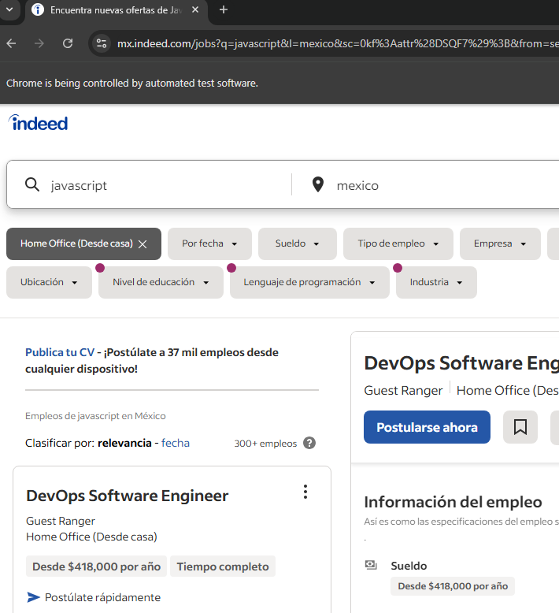
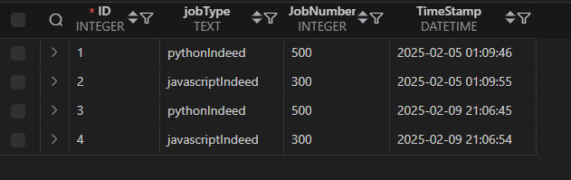

# 📊 Job Scraper (Indeed & LinkedIn)
A Python web scraper that extracts job counts for **Python** and **JavaScript** jobs from Indeed using **Selenium** and stores the data in an SQLite database.
---

## 🛠 Features
✔️ Scrapes job count for **Python** and **JavaScript** jobs  
✔️ Stores the data in an **SQLite database**  
✔️ Uses **Selenium WebDriver** for automation  
---

## 📷 Screenshots

### 🔍 Scraper Running


### 📊 Data in SQLite

---

## 🚀 Installation & Usage
### 1️⃣ **Clone the repository**

```sh
git clone https://github.com/yourusername/ScraperIndeed.git
cd ScraperIndeed
```
